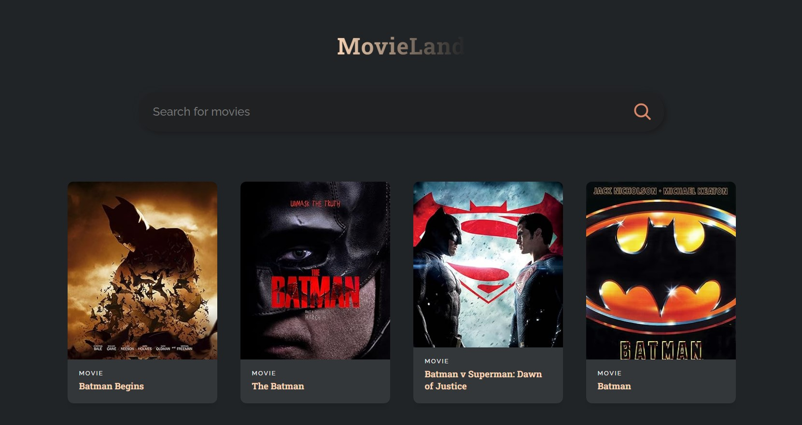

# Movieland: Movie Portal - ReactJs Project

- Movie Search Portal
- Welcome to the Movie Search Portal! This project is a small ReactJS application designed to help users search for movies and retrieve essential information about them such as release date and genre. With a simple and cool color styling, this portal offers a user-friendly interface for exploring movies effortlessly.

# Features

- Movie Search: Users can easily search for movies using the provided search bar.
- API Integration: The application interacts with a movie API to fetch relevant information about movies.
- Minimal Interaction: The design focuses on simplicity, providing users with a straightforward experience.
- Dynamic Results: Up to 50 movie slots are available per API call, ensuring a wide range of search results.
- Release Date & Genre: Users can quickly find out a movie's release date and genre.
- Responsive Design: The portal is designed to be responsive, ensuring compatibility across various devices.

# Technologies Used

- ReactJS: The frontend framework used for building the user interface.
- API: Integration with a movie API to fetch movie information.
- CSS: Styling the application with simple and cool color schemes.
- npm: Package manager for installing and managing project dependencies.

### Result Img of MovieLand:

  
